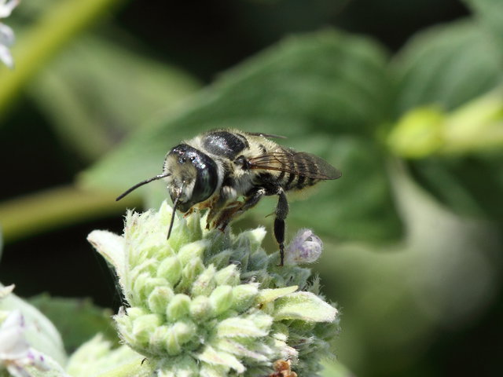
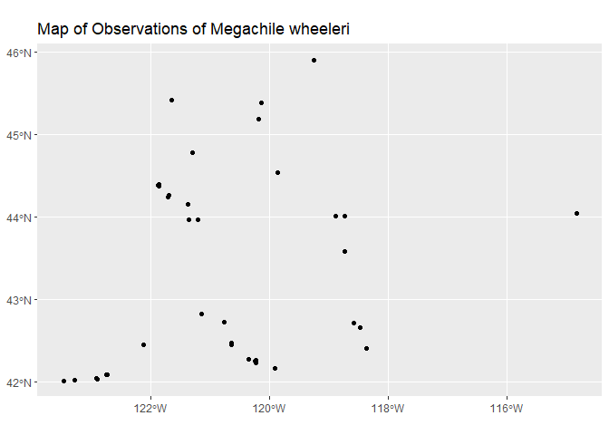
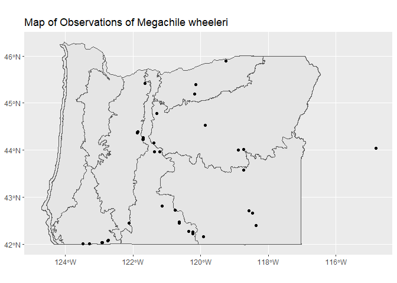
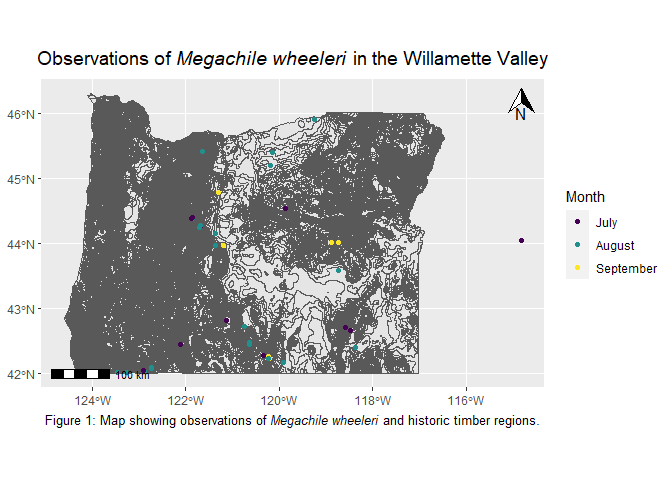

Exploring bee-related spatial data
================
Alejandro Santillana

<!-- Lesson Overview -->

# Conservation/ecology Topics

> - Species distributions

# Computational Topics

> - Convert a data frame to a spatial object.
> - Plot multiple spatial layers.

------------------------------------------------------------------------

# Lab part 1: Oregon bee atlas data exploration

1.  Import the OBA data.

``` r
OBA_data <- read.csv("OBA_2018-2023.csv")
```

2.  Find the columns related to genus and species and paste them
    together (with a space between) using the function paste(). Name the
    new column GenusSpecies.

``` r
OBA_data$GenusSpecies <- paste(OBA_data$Genus, OBA_data$Species, sep = " ") 
```

3.  Use `sort()` and `unique()` to print the unique values of
    GenusSpecies in alphabetical order. How many species are there?

``` r
sort(unique(OBA_data$GenusSpecies))
```

    ##   [1] " "                                "Agapostemon "                    
    ##   [3] "Agapostemon  femoratus"           "Agapostemon  texanus"            
    ##   [5] "Agapostemon  virescens "          "Agapostemon femoratus"           
    ##   [7] "Agapostemon melliventris"         "Agapostemon texanus"             
    ##   [9] "Agapostemon virescens"            "Andrena "                        
    ##  [11] "Andrena  "                        "Andrena angustitarsata"          
    ##  [13] "Andrena astragali"                "Andrena chlorogaster"            
    ##  [15] "Andrena crataegi "                "Andrena cupreotincta"            
    ##  [17] "Andrena cyanella"                 "Andrena fuscicauda"              
    ##  [19] "Andrena illinoiensis"             "Andrena nigrocaerulea"           
    ##  [21] "Andrena pallidifovea"             "Andrena perplexa"                
    ##  [23] "Andrena prunorum"                 "Andrena rubicundus"              
    ##  [25] "Andrena salicifloris"             "Andrena transnigra"              
    ##  [27] "Andrena vicina"                   "Anthidiellum "                   
    ##  [29] "Anthidiellum notatum"             "Anthidiellum robertsoni"         
    ##  [31] "Anthidium "                       "Anthidium  "                     
    ##  [33] "Anthidium  banningense"           "Anthidium  formosa"              
    ##  [35] "Anthidium  illustre"              "Anthidium  palliventre"          
    ##  [37] "Anthidium atrifrons"              "Anthidium atripes"               
    ##  [39] "Anthidium banningense"            "Anthidium emarginatum"           
    ##  [41] "Anthidium formosum"               "Anthidium illustre"              
    ##  [43] "Anthidium maculosom"              "Anthidium manicatum"             
    ##  [45] "Anthidium mormonum"               "Anthidium oblongatum"            
    ##  [47] "Anthidium palliventre"            "Anthidium placitum"              
    ##  [49] "Anthidium tenuiflorae"            "Anthidium utahense"              
    ##  [51] "Anthophora "                      "Anthophora affabilis"            
    ##  [53] "Anthophora albata"                "Anthophora bomboides"            
    ##  [55] "Anthophora californica"           "Anthophora curta"                
    ##  [57] "Anthophora edwardsii"             "Anthophora exigua"               
    ##  [59] "Anthophora lesquerellae"          "Anthophora maculifrons"          
    ##  [61] "Anthophora pacifica"              "Anthophora peritomae"            
    ##  [63] "Anthophora porterae"              "Anthophora terminalis"           
    ##  [65] "Anthophora urbana"                "Anthophora ursina"               
    ##  [67] "Anthophorini "                    "Anthophorula "                   
    ##  [69] "Anthophorula chionura"            "Apis mellifera"                  
    ##  [71] "Ashmeadiella "                    "Ashmeadiella  difugita"          
    ##  [73] "Ashmeadiella altadenae"           "Ashmeadiella bucconis"           
    ##  [75] "Ashmeadiella cactorum"            "Ashmeadiella californica"        
    ##  [77] "Ashmeadiella cubiceps"            "Ashmeadiella difugita"           
    ##  [79] "Ashmeadiella foveata"             "Ashmeadiella foxiella"           
    ##  [81] "Ashmeadiella prosopidis"          "Ashmeadiella timberlakei"        
    ##  [83] "Atoposmia "                       "Atoposmia abjecta"               
    ##  [85] "Atoposmia anthodyta"              "Atoposmia copelandica"           
    ##  [87] "Atoposmia elongata"               "Atoposmia oregona"               
    ##  [89] "Atoposmia triodonta"              "Biastes "                        
    ##  [91] "Bombus "                          "Bombus appositus"                
    ##  [93] "Bombus bifarius"                  "Bombus caliginosus"              
    ##  [95] "Bombus centralis"                 "Bombus fervidus"                 
    ##  [97] "Bombus flavidus"                  "Bombus flavifrons"               
    ##  [99] "Bombus griseocollis"              "Bombus huntii"                   
    ## [101] "Bombus impatiens"                 "Bombus insularis"                
    ## [103] "Bombus melanopygus"               "Bombus mixtus"                   
    ## [105] "Bombus morrisoni"                 "Bombus nevadensis"               
    ## [107] "Bombus occidentalis"              "Bombus rufocinctus"              
    ## [109] "Bombus sitkensis"                 "Bombus sylvicola"                
    ## [111] "Bombus vagans"                    "Bombus vancouverensis"           
    ## [113] "Bombus vandykei"                  "Bombus vosnesenskii"             
    ## [115] "Brachymelecta "                   "Brachymelecta californica"       
    ## [117] "Calliopsis "                      "Calliopsis anthidius"            
    ## [119] "Calliopsis coloradensis"          "Calliopsis edwardsii"            
    ## [121] "Calliopsis fracta"                "Calliopsis micheneri"            
    ## [123] "Calliopsis obscurella"            "Calliopsis personata"            
    ## [125] "Calliopsis puellae"               "Calliopsis scutellaris"          
    ## [127] "Calliopsis xenus"                 "Calliopsis zebrata"              
    ## [129] "Ceratina "                        "Ceratina  acantha "              
    ## [131] "Ceratina acantha"                 "Ceratina acantha "               
    ## [133] "Ceratina arizonensis"             "Ceratina arizonensus"            
    ## [135] "Ceratina dallatorreana"           "Ceratina hurdi"                  
    ## [137] "Ceratina micheneri"               "ceratina nanula"                 
    ## [139] "Ceratina nanula"                  "Ceratina neomexicana"            
    ## [141] "Ceratina pacifica"                "Ceratina sequoiae"               
    ## [143] "Ceratina tejonensis"              "Chelostoma "                     
    ## [145] "Chelostoma californicum"          "Chelostoma minutum"              
    ## [147] "Chelostoma phaceliae"             "Coelioxys "                      
    ## [149] "Coelioxys alternata"              "Coelioxys alternatus"            
    ## [151] "Coelioxys apacheorum"             "Coelioxys deani"                 
    ## [153] "Coelioxys edita"                  "Coelioxys funeraria"             
    ## [155] "Coelioxys grindeliae"             "Coelioxys hirsutissima"          
    ## [157] "Coelioxys hirsutissimus"          "Coelioxys hunteri"               
    ## [159] "Coelioxys mesae"                  "Coelioxys moesta"                
    ## [161] "Coelioxys moestus"                "Coelioxys novomexicana"          
    ## [163] "Coelioxys novomexicanus"          "Coelioxys octodentatus"          
    ## [165] "Coelioxys rufitarsis"             "Coelioxys serricaudata"          
    ## [167] "Coelioxys serricaudatus"          "Coelioxys sodalis"               
    ## [169] "Colletes "                        "Colletes  "                      
    ## [171] "Colletes centralis"               "Colletes coloradensis"           
    ## [173] "Colletes compactus"               "Colletes consors"                
    ## [175] "Colletes fulgidus"                "Colletes gypsicolens"            
    ## [177] "Colletes huntii"                  "Colletes kincaidii"              
    ## [179] "Colletes ligatus"                 "Colletes nigrifrons"             
    ## [181] "Colletes phaceliae"               "Colletes simulans"               
    ## [183] "Colletes slevini"                 "Diadasia "                       
    ## [185] "Diadasia  angusticeps"            "Diadasia  bituberculata"         
    ## [187] "Diadasia  enavata"                "Diadasia  nigrifrons"            
    ## [189] "Diadasia  opuntiae"               "Diadasia angusticeps"            
    ## [191] "Diadasia australis"               "Diadasia bituberculata"          
    ## [193] "Diadasia diminuta"                "Diadasia enavata"                
    ## [195] "Diadasia lutzi"                   "Diadasia nigrifrons"             
    ## [197] "Diadasia palmarum"                "Dianthidium "                    
    ## [199] "Dianthidium curvatum"             "Dianthidium dubium"              
    ## [201] "Dianthidium heterulkei"           "Dianthidium parvum"              
    ## [203] "Dianthidium platyurum"            "Dianthidium plenum"              
    ## [205] "Dianthidium pudicum"              "Dianthidium singulare"           
    ## [207] "Dianthidium subparvum"            "Dianthidium ulkei"               
    ## [209] "Dioxys "                          "Dioxys pomonae"                  
    ## [211] "Dufourea "                        "Dufourea holocyanea"             
    ## [213] "Dufourea trochantera"             "Dufourea versatilis"             
    ## [215] "Epeolus "                         "Epeolus compactus"               
    ## [217] "Epeolus novomexicanus"            "Epeolus olympiellus"             
    ## [219] "Eucera "                          "Eucera acerba"                   
    ## [221] "Eucera actuosa"                   "Eucera amsinckiae"               
    ## [223] "Eucera cordleyi"                  "Eucera edwardsii"                
    ## [225] "Eucera frater"                    "Eucera fulvitarsis"              
    ## [227] "Eucera hurdi"                     "Eucera lunata"                   
    ## [229] "Eucera mellifera"                 "Eucera speciosa"                 
    ## [231] "Eucera venusta"                   "Eucera virgata"                  
    ## [233] "Habropoda "                       "Habropoda  "                     
    ## [235] "Habropoda cineraria"              "Habropoda dammersi"              
    ## [237] "Habropoda depressa"               "Habropoda miserabilis"           
    ## [239] "Habropoda tristissima"            "Halictus "                       
    ## [241] "Halictus  confusus"               "Halictus  confusus "             
    ## [243] "Halictus  farinosus"              "Halictus  ligatus"               
    ## [245] "Halictus  rubicundus"             "Halictus  tripartitus"           
    ## [247] "Halictus  tripartitus "           "Halictus confusus"               
    ## [249] "Halictus farinosus"               "Halictus farinosus "             
    ## [251] "Halictus ligatus"                 "Halictus rubicundus"             
    ## [253] "Halictus tripartitus"             "Halictus virgatellus"            
    ## [255] "Heriades "                        "Heriades carinata"               
    ## [257] "Heriades carinatus"               "Heriades cressoni"               
    ## [259] "Heriades variolosus"              "Hoplitis "                       
    ## [261] "Hoplitis  "                       "Hoplitis albifrons"              
    ## [263] "Hoplitis albifrons "              "Hoplitis boharti"                
    ## [265] "Hoplitis emarginata"              "Hoplitis fulgida"                
    ## [267] "Hoplitis grinnelli"               "Hoplitis hypocrita"              
    ## [269] "Hoplitis louisae"                 "Hoplitis orthognatha"            
    ## [271] "Hoplitis plagiostoma"             "Hoplitis producta"               
    ## [273] "Hoplitis remotula"                "Hoplitis robusta"                
    ## [275] "Hoplitis sambuci"                 "Hoplitis uvulalis"               
    ## [277] "Hylaeus "                         "Hylaeus  basalis"                
    ## [279] "Hylaeus acantha"                  "Hylaeus basalis"                 
    ## [281] "Hylaeus mesillae"                 "Hylaeus Mesillae"                
    ## [283] "Hylaeus nunenmacheri"             "Lasioglossum "                   
    ## [285] "Lasioglossum  buccale"            "Lasioglossum  cressonii"         
    ## [287] "Lasioglossum  egregium"           "Lasioglossum  glabriventre"      
    ## [289] "Lasioglossum  olympiae"           "Lasioglossum  pacificum "        
    ## [291] "Lasioglossum  sisymbrii"          "Lasioglossum  titusi"            
    ## [293] "Lasioglossum  zonulum"            "Lasioglossum aberrans"           
    ## [295] "Lasioglossum aff. boreale"        "Lasioglossum aff. diatretum"     
    ## [297] "Lasioglossum albipenne"           "Lasioglossum albohirtum"         
    ## [299] "Lasioglossum allonotus"           "Lasioglossum anhypops"           
    ## [301] "Lasioglossum anhypops/trizonatum" "Lasioglossum argemonis"          
    ## [303] "Lasioglossum aspilurum"           "Lasioglossum avalonense"         
    ## [305] "Lasioglossum boreale"             "Lasioglossum brunneiventre"      
    ## [307] "Lasioglossum buccale"             "Lasioglossum colatum"            
    ## [309] "Lasioglossum cooleyi"             "Lasioglossum cordleyi"           
    ## [311] "Lasioglossum cressonii"           "Lasioglossum densa"              
    ## [313] "Lasioglossum diatretum"           "Lasioglossum diversopunctatum"   
    ## [315] "Lasioglossum ebmerellum"          "Lasioglossum egregium"           
    ## [317] "Lasioglossum giffardi"            "Lasioglossum glabriventre"       
    ## [319] "Lasioglossum helianthi"           "Lasioglossum hudsoniellum"       
    ## [321] "Lasioglossum imbrex"              "Lasioglossum incompletum"        
    ## [323] "Lasioglossum inconditum"          "Lasioglossum kincaidii"          
    ## [325] "Lasioglossum kincaldii"           "Lasioglossum knereri"            
    ## [327] "Lasioglossum laevissimum"         "Lasioglossum ligatus"            
    ## [329] "Lasioglossum lusoria"             "Lasioglossum macoupinense"       
    ## [331] "Lasioglossum macroprosopum"       "Lasioglossum megastictum"        
    ## [333] "Lasioglossum mellipes"            "Lasioglossum nevadense"          
    ## [335] "Lasioglossum nigrum"              "Lasioglossum nr pacatum"         
    ## [337] "Lasioglossum nr zephyrus"         "Lasioglossum occultum"           
    ## [339] "Lasioglossum olympiae"            "Lasioglossum ovaliceps"          
    ## [341] "Lasioglossum pacificum"           "Lasioglossum pavonotum"          
    ## [343] "Lasioglossum prasinogaster"       "Lasioglossum pruinosum"          
    ## [345] "Lasioglossum pulveris"            "Lasioglossum quebecense"         
    ## [347] "Lasioglossum robustum"            "Lasioglossum ruidosense"         
    ## [349] "Lasioglossum sequoiae"            "Lasioglossum sisymbrii"          
    ## [351] "Lasioglossum synthyridis"         "Lasioglossum tegulariforme"      
    ## [353] "Lasioglossum tenax"               "Lasioglossum texanus"            
    ## [355] "Lasioglossum titusi"              "Lasioglossum trizonatum"         
    ## [357] "Lasioglossum trizonatum group"    "Lasioglossum tuolumnense"        
    ## [359] "Lasioglossum vaporellum"          "Lasioglossum villosulum"         
    ## [361] "Lasioglossum vosnesenskii"        "Lasioglossum zephyrus"           
    ## [363] "Lasioglossum zonulum"             "Megachile "                      
    ## [365] "Megachile  perihirta"             "Megachile addenda"               
    ## [367] "Megachile angelarum"              "Megachile anograe"               
    ## [369] "Megachile apicalis"               "Megachile brevis"                
    ## [371] "Megachile centuncularis"          "Megachile coquilletti"           
    ## [373] "Megachile fidelis"                "Megachile frigida"               
    ## [375] "Megachile gemula"                 "Megachile gentilis"              
    ## [377] "Megachile gravita"                "Megachile inermis"               
    ## [379] "Megachile inimica"                "Megachile lapponica"             
    ## [381] "Megachile lippiae"                "Megachile melanophaea"           
    ## [383] "Megachile mellitarsis"            "Megachile mendica"               
    ## [385] "Megachile montivaga"              "Megachile nevadensis"            
    ## [387] "Megachile onobrychidis"           "Megachile parallela"             
    ## [389] "Megachile perihirta"              "Megachile pseudonigra"           
    ## [391] "Megachile pugnata"                "Megachile relativa"              
    ## [393] "Megachile rotundata"              "Megachile subnigra"              
    ## [395] "Megachile texana"                 "Megachile umatillensis"          
    ## [397] "Megachile wheeleri"               "Melecta "                        
    ## [399] "Melecta edwardsii"                "melecta pacifica"                
    ## [401] "Melecta pacifica"                 "Melecta separata"                
    ## [403] "Melecta thoracica"                "Melissodes "                     
    ## [405] "Melissodes agilis"                "Melissodes bimatris"             
    ## [407] "Melissodes bucconis"              "Melissodes clarkiae"             
    ## [409] "Melissodes communis"              "Melissodes farinosus"            
    ## [411] "Melissodes griseocollis"          "Melissodes huntii"               
    ## [413] "Melissodes lupinus"               "Melissodes lustrus"              
    ## [415] "Melissodes metenuus"              "Melissodes microstictus"         
    ## [417] "Melissodes pallidisignatus"       "Melissodes rivalis"              
    ## [419] "Melissodes robustior"             "Melissodes semilupinus"          
    ## [421] "Melissodes urbana"                "Melissodes vosnesenskii"         
    ## [423] "Micralictoides ruficauda"         "Neolarra "                       
    ## [425] "Neolarra vandykei"                "Neolarra vigilans"               
    ## [427] "Neopasites fulviventris"          "Nomada "                         
    ## [429] "Nomia "                           "Nomia melanderi"                 
    ## [431] "Oreopasites "                     "Osmia "                          
    ## [433] "Osmia  "                          "Osmia  brevis"                   
    ## [435] "Osmia  californica"               "Osmia  densa"                    
    ## [437] "Osmia  exigua"                    "Osmia  gaudiosa"                 
    ## [439] "Osmia  kincaidii"                 "Osmia  lignaria"                 
    ## [441] "Osmia  longula"                   "Osmia  montana"                  
    ## [443] "Osmia  nemoris"                   "Osmia  obliqua"                  
    ## [445] "Osmia  ribifloris"                "Osmia aglaia"                    
    ## [447] "Osmia atrocyanea"                 "Osmia brevis"                    
    ## [449] "Osmia bruneri"                    "Osmia bucephala"                 
    ## [451] "Osmia caerulescens"               "Osmia californica"               
    ## [453] "Osmia calla"                      "Osmia cara"                      
    ## [455] "Osmia cobaltina"                  "Osmia coloradensis"              
    ## [457] "Osmia cornifrons"                 "Osmia cyanella"                  
    ## [459] "Osmia densa"                      "Osmia enixa"                     
    ## [461] "Osmia exigua"                     "Osmia gabrielis"                 
    ## [463] "Osmia gaudiosa"                   "Osmia glauca"                    
    ## [465] "Osmia integra"                    "Osmia inurbana"                  
    ## [467] "Osmia juxta"                      "Osmia kincaidii"                 
    ## [469] "Osmia laeta"                      "Osmia lanei"                     
    ## [471] "Osmia lignaria"                   "Osmia longula"                   
    ## [473] "Osmia macswaini"                  "Osmia malina"                    
    ## [475] "Osmia marginipennis"              "Osmia melanopleura"              
    ## [477] "Osmia montana"                    "Osmia nemoris"                   
    ## [479] "Osmia nifoata"                    "Osmia nigrifrons"                
    ## [481] "Osmia obliqua"                    "Osmia phaceliae"                 
    ## [483] "Osmia physariae"                  "Osmia pusilla"                   
    ## [485] "Osmia regulina"                   "Osmia ribifloris"                
    ## [487] "Osmia rostrata"                   "Osmia rotundata"                 
    ## [489] "Osmia sericea"                    "Osmia simillima"                 
    ## [491] "Osmia sladeni"                    "Osmia tanneri"                   
    ## [493] "Osmia tarsata"                    "Osmia titusi"                    
    ## [495] "Osmia trevoris"                   "Osmia tripartitus"               
    ## [497] "Osmia vandykei"                   "Osmia visenda"                   
    ## [499] "Panurginus "                      "Peponapis pruinosa"              
    ## [501] "Perdita "                         "Perdita nevadensis"              
    ## [503] "Protandrena "                     "Protosmia "                      
    ## [505] "Protosmia rubifloris"             "Pseudoanthidium "                
    ## [507] "Pseudoanthidium nanum"            "Pseudopanurgus "                 
    ## [509] "Sphecodes "                       "Sphecodes arvensiformis"         
    ## [511] "Sphecodes boreale"                "Sphecodes confertus"             
    ## [513] "Sphecodes griseocollis"           "Sphecodes kincaidii"             
    ## [515] "Sphecodes pecosensis"             "Sphecodes sisymbrii"             
    ## [517] "Stelis "                          "Stelis laticincta"               
    ## [519] "Stelis montana"                   "Svastra "                        
    ## [521] "Svastra obliqua"                  "Trachusa timberlakei"            
    ## [523] "Triepeolus "                      "Triepeolus argyreus"             
    ## [525] "Triepeolus californicus"          "Triepeolus concavus"             
    ## [527] "Triepeolus helianthi"             "Triepeolus heterurus"            
    ## [529] "Triepeolus lunatus"               "Triepeolus melanarius"           
    ## [531] "Triepeolus paenepectoralis"       "Triepeolus verbesinae complex"   
    ## [533] "Xenoglossodes "                   "Xenoglossodes agilis"            
    ## [535] "Xenoglossodes rivalis"            "Xylocopa californica"            
    ## [537] "Xylocopa tabaniformis"            "Xylocopa virginica"              
    ## [539] "Zacosmia maculata"

-Around 540.

Some specimens are not identified to species, only genus. How is this
reflected in the data? -Only the genus is included. In two weeks we will
learn how to clean this up using regular expressions.

4.  So many bees, so little time. Count up the occurrences of each bee
    species, and subset the data to bees that have been seen at least
    two times. You can use the tidyverse or any other functions in R
    that you like. How many “species” are there?

``` r
OBA_filtered_data <- OBA_data %>%
  group_by(GenusSpecies) %>%
  filter(n() >= 2) %>%
  ungroup()

sort(unique(OBA_filtered_data$GenusSpecies))
```

    ##   [1] " "                                "Agapostemon "                    
    ##   [3] "Agapostemon  femoratus"           "Agapostemon  texanus"            
    ##   [5] "Agapostemon  virescens "          "Agapostemon femoratus"           
    ##   [7] "Agapostemon melliventris"         "Agapostemon texanus"             
    ##   [9] "Agapostemon virescens"            "Andrena "                        
    ##  [11] "Andrena  "                        "Andrena angustitarsata"          
    ##  [13] "Andrena chlorogaster"             "Andrena cupreotincta"            
    ##  [15] "Andrena fuscicauda"               "Andrena illinoiensis"            
    ##  [17] "Andrena nigrocaerulea"            "Andrena pallidifovea"            
    ##  [19] "Andrena perplexa"                 "Andrena prunorum"                
    ##  [21] "Andrena salicifloris"             "Andrena vicina"                  
    ##  [23] "Anthidiellum "                    "Anthidiellum notatum"            
    ##  [25] "Anthidiellum robertsoni"          "Anthidium "                      
    ##  [27] "Anthidium  "                      "Anthidium  banningense"          
    ##  [29] "Anthidium  palliventre"           "Anthidium atrifrons"             
    ##  [31] "Anthidium atripes"                "Anthidium banningense"           
    ##  [33] "Anthidium emarginatum"            "Anthidium illustre"              
    ##  [35] "Anthidium manicatum"              "Anthidium mormonum"              
    ##  [37] "Anthidium oblongatum"             "Anthidium palliventre"           
    ##  [39] "Anthidium placitum"               "Anthidium tenuiflorae"           
    ##  [41] "Anthidium utahense"               "Anthophora "                     
    ##  [43] "Anthophora albata"                "Anthophora bomboides"            
    ##  [45] "Anthophora californica"           "Anthophora curta"                
    ##  [47] "Anthophora edwardsii"             "Anthophora exigua"               
    ##  [49] "Anthophora maculifrons"           "Anthophora pacifica"             
    ##  [51] "Anthophora porterae"              "Anthophora terminalis"           
    ##  [53] "Anthophora urbana"                "Anthophora ursina"               
    ##  [55] "Anthophorini "                    "Anthophorula chionura"           
    ##  [57] "Apis mellifera"                   "Ashmeadiella "                   
    ##  [59] "Ashmeadiella altadenae"           "Ashmeadiella bucconis"           
    ##  [61] "Ashmeadiella cactorum"            "Ashmeadiella californica"        
    ##  [63] "Ashmeadiella cubiceps"            "Ashmeadiella difugita"           
    ##  [65] "Ashmeadiella foveata"             "Ashmeadiella foxiella"           
    ##  [67] "Ashmeadiella prosopidis"          "Ashmeadiella timberlakei"        
    ##  [69] "Atoposmia "                       "Atoposmia abjecta"               
    ##  [71] "Atoposmia copelandica"            "Atoposmia elongata"              
    ##  [73] "Atoposmia oregona"                "Atoposmia triodonta"             
    ##  [75] "Biastes "                         "Bombus "                         
    ##  [77] "Bombus appositus"                 "Bombus bifarius"                 
    ##  [79] "Bombus caliginosus"               "Bombus centralis"                
    ##  [81] "Bombus fervidus"                  "Bombus flavidus"                 
    ##  [83] "Bombus flavifrons"                "Bombus griseocollis"             
    ##  [85] "Bombus huntii"                    "Bombus impatiens"                
    ##  [87] "Bombus insularis"                 "Bombus melanopygus"              
    ##  [89] "Bombus mixtus"                    "Bombus morrisoni"                
    ##  [91] "Bombus nevadensis"                "Bombus occidentalis"             
    ##  [93] "Bombus rufocinctus"               "Bombus sitkensis"                
    ##  [95] "Bombus sylvicola"                 "Bombus vagans"                   
    ##  [97] "Bombus vancouverensis"            "Bombus vandykei"                 
    ##  [99] "Bombus vosnesenskii"              "Brachymelecta "                  
    ## [101] "Brachymelecta californica"        "Calliopsis "                     
    ## [103] "Calliopsis anthidius"             "Calliopsis coloradensis"         
    ## [105] "Calliopsis edwardsii"             "Calliopsis fracta"               
    ## [107] "Calliopsis micheneri"             "Calliopsis obscurella"           
    ## [109] "Calliopsis personata"             "Calliopsis scutellaris"          
    ## [111] "Calliopsis xenus"                 "Ceratina "                       
    ## [113] "Ceratina  acantha "               "Ceratina acantha"                
    ## [115] "Ceratina acantha "                "Ceratina arizonensus"            
    ## [117] "Ceratina hurdi"                   "Ceratina micheneri"              
    ## [119] "Ceratina nanula"                  "Ceratina neomexicana"            
    ## [121] "Ceratina pacifica"                "Ceratina sequoiae"               
    ## [123] "Ceratina tejonensis"              "Chelostoma "                     
    ## [125] "Chelostoma californicum"          "Chelostoma minutum"              
    ## [127] "Chelostoma phaceliae"             "Coelioxys "                      
    ## [129] "Coelioxys alternata"              "Coelioxys alternatus"            
    ## [131] "Coelioxys apacheorum"             "Coelioxys deani"                 
    ## [133] "Coelioxys edita"                  "Coelioxys grindeliae"            
    ## [135] "Coelioxys hirsutissima"           "Coelioxys hirsutissimus"         
    ## [137] "Coelioxys hunteri"                "Coelioxys moestus"               
    ## [139] "Coelioxys novomexicanus"          "Coelioxys octodentatus"          
    ## [141] "Coelioxys rufitarsis"             "Coelioxys serricaudatus"         
    ## [143] "Coelioxys sodalis"                "Colletes "                       
    ## [145] "Colletes  "                       "Colletes centralis"              
    ## [147] "Colletes coloradensis"            "Colletes compactus"              
    ## [149] "Colletes consors"                 "Colletes fulgidus"               
    ## [151] "Colletes gypsicolens"             "Colletes kincaidii"              
    ## [153] "Colletes nigrifrons"              "Colletes phaceliae"              
    ## [155] "Colletes simulans"                "Colletes slevini"                
    ## [157] "Diadasia "                        "Diadasia  angusticeps"           
    ## [159] "Diadasia  bituberculata"          "Diadasia  enavata"               
    ## [161] "Diadasia  nigrifrons"             "Diadasia angusticeps"            
    ## [163] "Diadasia australis"               "Diadasia bituberculata"          
    ## [165] "Diadasia diminuta"                "Diadasia enavata"                
    ## [167] "Diadasia lutzi"                   "Diadasia nigrifrons"             
    ## [169] "Diadasia palmarum"                "Dianthidium "                    
    ## [171] "Dianthidium curvatum"             "Dianthidium dubium"              
    ## [173] "Dianthidium heterulkei"           "Dianthidium parvum"              
    ## [175] "Dianthidium platyurum"            "Dianthidium plenum"              
    ## [177] "Dianthidium pudicum"              "Dianthidium subparvum"           
    ## [179] "Dianthidium ulkei"                "Dioxys "                         
    ## [181] "Dufourea "                        "Dufourea holocyanea"             
    ## [183] "Dufourea trochantera"             "Dufourea versatilis"             
    ## [185] "Epeolus "                         "Epeolus compactus"               
    ## [187] "Epeolus novomexicanus"            "Epeolus olympiellus"             
    ## [189] "Eucera "                          "Eucera acerba"                   
    ## [191] "Eucera actuosa"                   "Eucera amsinckiae"               
    ## [193] "Eucera cordleyi"                  "Eucera edwardsii"                
    ## [195] "Eucera frater"                    "Eucera fulvitarsis"              
    ## [197] "Eucera lunata"                    "Eucera venusta"                  
    ## [199] "Eucera virgata"                   "Habropoda "                      
    ## [201] "Habropoda  "                      "Habropoda cineraria"             
    ## [203] "Habropoda dammersi"               "Habropoda depressa"              
    ## [205] "Habropoda miserabilis"            "Habropoda tristissima"           
    ## [207] "Halictus "                        "Halictus  confusus "             
    ## [209] "Halictus  ligatus"                "Halictus  rubicundus"            
    ## [211] "Halictus  tripartitus"            "Halictus  tripartitus "          
    ## [213] "Halictus confusus"                "Halictus farinosus"              
    ## [215] "Halictus farinosus "              "Halictus ligatus"                
    ## [217] "Halictus rubicundus"              "Halictus tripartitus"            
    ## [219] "Halictus virgatellus"             "Heriades "                       
    ## [221] "Heriades carinata"                "Heriades carinatus"              
    ## [223] "Heriades cressoni"                "Heriades variolosus"             
    ## [225] "Hoplitis "                        "Hoplitis  "                      
    ## [227] "Hoplitis albifrons"               "Hoplitis albifrons "             
    ## [229] "Hoplitis boharti"                 "Hoplitis emarginata"             
    ## [231] "Hoplitis fulgida"                 "Hoplitis grinnelli"              
    ## [233] "Hoplitis hypocrita"               "Hoplitis louisae"                
    ## [235] "Hoplitis orthognatha"             "Hoplitis plagiostoma"            
    ## [237] "Hoplitis producta"                "Hoplitis remotula"               
    ## [239] "Hoplitis sambuci"                 "Hylaeus "                        
    ## [241] "Hylaeus basalis"                  "Hylaeus mesillae"                
    ## [243] "Hylaeus Mesillae"                 "Hylaeus nunenmacheri"            
    ## [245] "Lasioglossum "                    "Lasioglossum  cressonii"         
    ## [247] "Lasioglossum  pacificum "         "Lasioglossum  sisymbrii"         
    ## [249] "Lasioglossum  titusi"             "Lasioglossum aberrans"           
    ## [251] "Lasioglossum aff. boreale"        "Lasioglossum aff. diatretum"     
    ## [253] "Lasioglossum albipenne"           "Lasioglossum albohirtum"         
    ## [255] "Lasioglossum allonotus"           "Lasioglossum anhypops"           
    ## [257] "Lasioglossum anhypops/trizonatum" "Lasioglossum argemonis"          
    ## [259] "Lasioglossum aspilurum"           "Lasioglossum avalonense"         
    ## [261] "Lasioglossum boreale"             "Lasioglossum brunneiventre"      
    ## [263] "Lasioglossum buccale"             "Lasioglossum colatum"            
    ## [265] "Lasioglossum cooleyi"             "Lasioglossum cordleyi"           
    ## [267] "Lasioglossum cressonii"           "Lasioglossum diatretum"          
    ## [269] "Lasioglossum diversopunctatum"    "Lasioglossum ebmerellum"         
    ## [271] "Lasioglossum egregium"            "Lasioglossum glabriventre"       
    ## [273] "Lasioglossum helianthi"           "Lasioglossum hudsoniellum"       
    ## [275] "Lasioglossum imbrex"              "Lasioglossum incompletum"        
    ## [277] "Lasioglossum inconditum"          "Lasioglossum kincaidii"          
    ## [279] "Lasioglossum kincaldii"           "Lasioglossum knereri"            
    ## [281] "Lasioglossum laevissimum"         "Lasioglossum ligatus"            
    ## [283] "Lasioglossum lusoria"             "Lasioglossum macoupinense"       
    ## [285] "Lasioglossum macroprosopum"       "Lasioglossum megastictum"        
    ## [287] "Lasioglossum mellipes"            "Lasioglossum nevadense"          
    ## [289] "Lasioglossum nigrum"              "Lasioglossum nr pacatum"         
    ## [291] "Lasioglossum nr zephyrus"         "Lasioglossum occultum"           
    ## [293] "Lasioglossum olympiae"            "Lasioglossum ovaliceps"          
    ## [295] "Lasioglossum pacificum"           "Lasioglossum pavonotum"          
    ## [297] "Lasioglossum pruinosum"           "Lasioglossum pulveris"           
    ## [299] "Lasioglossum quebecense"          "Lasioglossum robustum"           
    ## [301] "Lasioglossum ruidosense"          "Lasioglossum sequoiae"           
    ## [303] "Lasioglossum sisymbrii"           "Lasioglossum synthyridis"        
    ## [305] "Lasioglossum tegulariforme"       "Lasioglossum tenax"              
    ## [307] "Lasioglossum titusi"              "Lasioglossum trizonatum"         
    ## [309] "Lasioglossum trizonatum group"    "Lasioglossum tuolumnense"        
    ## [311] "Lasioglossum vaporellum"          "Lasioglossum villosulum"         
    ## [313] "Lasioglossum zephyrus"            "Lasioglossum zonulum"            
    ## [315] "Megachile "                       "Megachile  perihirta"            
    ## [317] "Megachile addenda"                "Megachile angelarum"             
    ## [319] "Megachile anograe"                "Megachile apicalis"              
    ## [321] "Megachile brevis"                 "Megachile centuncularis"         
    ## [323] "Megachile coquilletti"            "Megachile fidelis"               
    ## [325] "Megachile frigida"                "Megachile gemula"                
    ## [327] "Megachile gentilis"               "Megachile gravita"               
    ## [329] "Megachile inermis"                "Megachile inimica"               
    ## [331] "Megachile lapponica"              "Megachile lippiae"               
    ## [333] "Megachile melanophaea"            "Megachile mellitarsis"           
    ## [335] "Megachile montivaga"              "Megachile nevadensis"            
    ## [337] "Megachile onobrychidis"           "Megachile parallela"             
    ## [339] "Megachile perihirta"              "Megachile pseudonigra"           
    ## [341] "Megachile pugnata"                "Megachile relativa"              
    ## [343] "Megachile rotundata"              "Megachile subnigra"              
    ## [345] "Megachile umatillensis"           "Megachile wheeleri"              
    ## [347] "Melecta edwardsii"                "melecta pacifica"                
    ## [349] "Melecta pacifica"                 "Melecta separata"                
    ## [351] "Melecta thoracica"                "Melissodes "                     
    ## [353] "Melissodes agilis"                "Melissodes bimatris"             
    ## [355] "Melissodes clarkiae"              "Melissodes communis"             
    ## [357] "Melissodes lupinus"               "Melissodes metenuus"             
    ## [359] "Melissodes microstictus"          "Melissodes pallidisignatus"      
    ## [361] "Melissodes rivalis"               "Melissodes robustior"            
    ## [363] "Melissodes semilupinus"           "Micralictoides ruficauda"        
    ## [365] "Neolarra "                        "Neolarra vigilans"               
    ## [367] "Nomada "                          "Nomia melanderi"                 
    ## [369] "Oreopasites "                     "Osmia "                          
    ## [371] "Osmia  "                          "Osmia  brevis"                   
    ## [373] "Osmia  densa"                     "Osmia  kincaidii"                
    ## [375] "Osmia  lignaria"                  "Osmia  longula"                  
    ## [377] "Osmia  nemoris"                   "Osmia  obliqua"                  
    ## [379] "Osmia aglaia"                     "Osmia atrocyanea"                
    ## [381] "Osmia brevis"                     "Osmia bruneri"                   
    ## [383] "Osmia bucephala"                  "Osmia caerulescens"              
    ## [385] "Osmia californica"                "Osmia calla"                     
    ## [387] "Osmia cara"                       "Osmia cobaltina"                 
    ## [389] "Osmia coloradensis"               "Osmia cornifrons"                
    ## [391] "Osmia cyanella"                   "Osmia densa"                     
    ## [393] "Osmia enixa"                      "Osmia exigua"                    
    ## [395] "Osmia gabrielis"                  "Osmia gaudiosa"                  
    ## [397] "Osmia glauca"                     "Osmia integra"                   
    ## [399] "Osmia inurbana"                   "Osmia juxta"                     
    ## [401] "Osmia kincaidii"                  "Osmia laeta"                     
    ## [403] "Osmia lignaria"                   "Osmia longula"                   
    ## [405] "Osmia macswaini"                  "Osmia malina"                    
    ## [407] "Osmia marginipennis"              "Osmia melanopleura"              
    ## [409] "Osmia montana"                    "Osmia nemoris"                   
    ## [411] "Osmia nigrifrons"                 "Osmia obliqua"                   
    ## [413] "Osmia phaceliae"                  "Osmia physariae"                 
    ## [415] "Osmia pusilla"                    "Osmia regulina"                  
    ## [417] "Osmia ribifloris"                 "Osmia sericea"                   
    ## [419] "Osmia trevoris"                   "Osmia vandykei"                  
    ## [421] "Osmia visenda"                    "Panurginus "                     
    ## [423] "Peponapis pruinosa"               "Perdita "                        
    ## [425] "Perdita nevadensis"               "Protandrena "                    
    ## [427] "Protosmia "                       "Protosmia rubifloris"            
    ## [429] "Pseudoanthidium "                 "Pseudoanthidium nanum"           
    ## [431] "Pseudopanurgus "                  "Sphecodes "                      
    ## [433] "Sphecodes arvensiformis"          "Sphecodes confertus"             
    ## [435] "Sphecodes kincaidii"              "Sphecodes pecosensis"            
    ## [437] "Stelis "                          "Stelis laticincta"               
    ## [439] "Stelis montana"                   "Svastra obliqua"                 
    ## [441] "Trachusa timberlakei"             "Triepeolus "                     
    ## [443] "Triepeolus argyreus"              "Triepeolus concavus"             
    ## [445] "Triepeolus helianthi"             "Triepeolus heterurus"            
    ## [447] "Triepeolus melanarius"            "Triepeolus paenepectoralis"      
    ## [449] "Triepeolus verbesinae complex"    "Xenoglossodes "                  
    ## [451] "Xenoglossodes agilis"             "Xylocopa californica"            
    ## [453] "Xylocopa tabaniformis"            "Xylocopa virginica"              
    ## [455] "Zacosmia maculata"

- About 450

5.  Google a few bee names (that have been seen \> 2 times) and find one
    with a look that resonates with you.

What is the name of your bee? - Megachile wheeleri

Import the photos into Rmarkdown below (hint: googling bee name
“discover life” or “inat” can often get you a photo. Many bees will no
have any photos :(



# Lab part 2: Plotting the distrubution of your spirit bee.

Now that have chosen your spirit bee, we would like to plot it’s
distribution. What is the crs of the data? Annoyingly it is not
described anywhere in the spreadsheet (always list your crs in your
data) but it is the same as what inat uses because all bees have a
georeferenced plant host. If the data is in lat long, it is
“unprojected” so only a datum will be listed. DATUM: WGS84, unprojected
lat long. EPSG code: 4326.

``` r
crs("EPSG:4326")
```

    ## [1] "GEOGCRS[\"WGS 84\",\n    ENSEMBLE[\"World Geodetic System 1984 ensemble\",\n        MEMBER[\"World Geodetic System 1984 (Transit)\"],\n        MEMBER[\"World Geodetic System 1984 (G730)\"],\n        MEMBER[\"World Geodetic System 1984 (G873)\"],\n        MEMBER[\"World Geodetic System 1984 (G1150)\"],\n        MEMBER[\"World Geodetic System 1984 (G1674)\"],\n        MEMBER[\"World Geodetic System 1984 (G1762)\"],\n        MEMBER[\"World Geodetic System 1984 (G2139)\"],\n        ELLIPSOID[\"WGS 84\",6378137,298.257223563,\n            LENGTHUNIT[\"metre\",1]],\n        ENSEMBLEACCURACY[2.0]],\n    PRIMEM[\"Greenwich\",0,\n        ANGLEUNIT[\"degree\",0.0174532925199433]],\n    CS[ellipsoidal,2],\n        AXIS[\"geodetic latitude (Lat)\",north,\n            ORDER[1],\n            ANGLEUNIT[\"degree\",0.0174532925199433]],\n        AXIS[\"geodetic longitude (Lon)\",east,\n            ORDER[2],\n            ANGLEUNIT[\"degree\",0.0174532925199433]],\n    USAGE[\n        SCOPE[\"Horizontal component of 3D system.\"],\n        AREA[\"World.\"],\n        BBOX[-90,-180,90,180]],\n    ID[\"EPSG\",4326]]"

1.  Extract the X and Y locations for your species only from the data
    and create a spatial object. Don’t forget to set the CRS! Hint 1:
    consider what other data you would like to keep as attributes, for
    example what flower they were foraging on. Hint 2: Remember the lat
    is y and long is x. Hint 3: You may want to rename the column names
    you can use, colnames() and reassign the names, since the ones in
    the oba data spreadsheet are really ugly.

``` r
library(lubridate)
```

    ## 
    ## Attaching package: 'lubridate'

    ## The following objects are masked from 'package:terra':
    ## 
    ##     intersect, union

    ## The following objects are masked from 'package:base':
    ## 
    ##     date, intersect, setdiff, union

``` r
megachile_wheeleri_df <- OBA_filtered_data %>%
  filter(GenusSpecies == "Megachile wheeleri") %>%
  select(Observation.No., Collection.Date, Dec..Lat., Dec..Long., Associated.plant)

megachile_wheeleri_df <- megachile_wheeleri_df %>%
  mutate(
    Collection.Date = mdy(Collection.Date), 
    Month = month(Collection.Date)           
  )

megachile_wheeleri_df$Month <- factor(megachile_wheeleri_df$Month, 
                                    levels = 1:12, 
                                    labels = month.name)

megachile_wheeleri_sp <- st_as_sf(megachile_wheeleri_df,
                                   coords = c("Dec..Long.", "Dec..Lat."),
                                   crs = 4326)
```

2.  Plot your exciting bee data!

``` r
ggplot() +
  geom_sf(data = megachile_wheeleri_sp) +
  ggtitle("Map of Observations of Megachile wheeleri")
```

<!-- -->

Not so exciting without some kind of background…

Luckily we can download basemaps into R using the map_data function in
ggplot (among many others). There is an example for retrieving the
Oregon county polygons.

``` r
or <- map_data("county", "oregon") %>% 
  select(lon = long, lat, group, id = subregion)
```

3.  Add your species’s points to your choice of an Oregon basemap.

``` r
library(ggspatial)
ecoregion <- st_read("OR-ecoregions/Ecoregions_OregonConservationStrategy.shp")
```

    ## Reading layer `Ecoregions_OregonConservationStrategy' from data source 
    ##   `C:\Users\ale_s\OneDrive\Documents\Work-and-Study\UOregon\Year-2\Fall24\Bi510_DataScienceinEcologyandConservation\ds-environ-asf\6_OBA_spatial\OR-ecoregions\Ecoregions_OregonConservationStrategy.shp' 
    ##   using driver `ESRI Shapefile'
    ## Simple feature collection with 9 features and 6 fields
    ## Geometry type: POLYGON
    ## Dimension:     XY
    ## Bounding box:  xmin: 183871.7 ymin: 88600.88 xmax: 2345213 ymax: 1675043
    ## Projected CRS: NAD83 / Oregon GIC Lambert (ft)

``` r
ecoregion <- st_transform(ecoregion, crs(megachile_wheeleri_sp), res = res(megachile_wheeleri_sp))

ggplot() +
  geom_sf(data=ecoregion) + 
  geom_sf(data = megachile_wheeleri_sp) +
  ggtitle("Map of Observations of Megachile wheeleri")
```

<!-- -->
\# Lab part 3: Cartography

1.  Here is your moment to explore your cartographic skills.

<!-- -->

1.  Add another spatial layer relevant to your final project and tweak
    the Oregon map in anyway that is useful/visually appealing. You may
    need to crop that layer to the extent of your species’s
    distribution.
2.  Color your points according to some data attribute and add a legend
    (month collected, county, collector, associated plant, whatever you
    think is interesting). You may need to circle back to 2.1 to save
    additional attributes when you converted the dataframe to a spatial
    object.
3.  Fine-tune your map: add a title, make sure the legend label makes
    sense, add a scale bar (google “add scale bar map ggplot” and choose
    your favorite package). All maps must always have a scale bar. You
    can add a N arrow as well, though some cartographers argue that is
    only necessary if N isn’t at the top of the map.
4.  Write a figure caption for your map explaining any interesting
    trends you see.
5.  Export you cropped layer to a .shp so you can use it again for your
    final project.
6.  Push this lab to your github repo (just the .Rmd, don’t push the
    data!)

``` r
# canopy_cover <-
#   rast("oregon/orUTM11.tif")
# canopy_cover <- read_stars("oregon/orUTM11.tif")
# 
# canopy_cover_df <- as.data.frame(canopy_cover, xy = TRUE)
my_crs <- st_crs(megachile_wheeleri_sp)
# CHM_HARV_sp <- st_as_sf(CHM_HARV_df, coords = c("x", "y"), crs = my_crs)

precip <- st_read("precipitation/precip1981_2010_a_or.shp")
```

    ## Reading layer `precip1981_2010_a_or' from data source 
    ##   `C:\Users\ale_s\OneDrive\Documents\Work-and-Study\UOregon\Year-2\Fall24\Bi510_DataScienceinEcologyandConservation\ds-environ-asf\6_OBA_spatial\precipitation\precip1981_2010_a_or.shp' 
    ##   using driver `ESRI Shapefile'
    ## Simple feature collection with 198 features and 3 fields
    ## Geometry type: MULTIPOLYGON
    ## Dimension:     XY
    ## Bounding box:  xmin: -124.5958 ymin: 41.99179 xmax: -116.4633 ymax: 46.2991
    ## Geodetic CRS:  WGS 84

``` r
my_crs <- st_crs(megachile_wheeleri_sp)


ggplot() +
  geom_sf(data = precip) +
  geom_sf(data = megachile_wheeleri_sp, aes(color= as.factor(Month))) +
  ggtitle(expression("Observations of " * italic("Megachile wheeleri") * "\n in the Willamette Valley")) +
  # coord_sf(xlim = c(-124, -122), ylim = c(43.5, 46), expand = FALSE) +
  scale_color_viridis_d(name = "Month") +
  annotation_scale(location = "bl", width_hint = 0.2) +
  annotation_north_arrow(location = "tr", which_north = "true", height = unit(0.7, "cm"), width = unit(0.7, "cm")) +
  labs(caption = expression("Figure 1: Map showing observations of " * italic("Megachile wheeleri") * " and historic timber regions.")) +
  theme(
    plot.caption = element_text(size = 10, hjust = 0.5),
    plot.title = element_text(size = 14, hjust = 0.5) 
  )
```

<!-- -->

We are looking forward to seeing the maps you create!

# Lab part 4: Spatial summary statistics

For your final projects, you will likely need to come up with summary
statistics that describes the areas around where bees are captured. a.
Using the distribution of your chosen bee and the spatial layer you
imported in 2.6, extract a meaningful summary statistics from your
spatial layer within a buffer of 500, 750 1000 km. b. Create a plot that
illustrates this summary data (box plot, barplot, scatter plot,
historgram). c. Create a map of your cropped spatial data.

``` r
# r <- rast(ext(precip), resolution = 1000, crs = crs(megachile_wheeleri_sp))
# precip_rast <- rasterize(precip, r, field = "PrecipInch")
# 
# 
# 
# precip_Megachile_wheeleri <- extract(x = precip,
#                                   y = st_buffer(megachile_wheeleri_sp, dist = 500),
#                                   fun = sum)
```
