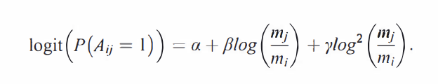

<!-- Lesson Overview -->
# Computational Topics
- Build and visualize food webs 
- Write functions to implement mathematical equations

# Conservation topics
-  Paleofood webs
-  Species extinction

In this lab we will practice our network visualization and manipulation skills using the paleo food web data from [Yeakel et al. 2014](https://doi.org/10.1073/pnas.1408471111). 


See the beautiful, animated version of the graphic above [here](https://infograficos.estadao.com.br/public/cidades/extincoes-egito/)

```{r load-libraries, echo=FALSE, results="hide", message=FALSE, warning=FALSE}
library(igraph)
library(tidyverse)
library(bipartite)
library(networkD3)
```

With some interaction networks we can observe the interactions, for example plant-pollinator networks, seed-disperal networks, human social networks. In food webs sometimes feeding interactions are observed directly, through camera traps, people doing timed observations, and now molecular analysis of gut contents/scat. However, often with food webs people build probabilistic models of who interacts with who based on body size (as in the Yeakel et al. 2014), especially with paleowebs. Thus the data from Yeakel et al. is 1) an occurrence matrix  (Figure 2 from the publication) and a matrix of body sizes (two columns, females then males). We will use these data to build the foodwebs for each time period. This lab is pretty challenging because it will use many of our core programming skills (for loops, writing functions, subsetting data) and our network skills. 

First we will read in the data. The matrix we are reading in has no row or column names, we will have to set them. 

```{r load-data}
sp_occ <- read.table(file="data/egypt_data.txt", header = FALSE)
str(sp_occ)
sp_mass <- read.table(file="data/egypt_mass.txt", header=FALSE)
str(sp_mass)
colnames(sp_mass) <- c("f","m")
```


The rows are arranged in the order of Figure 2 of the manuscript. To set the rownames we can make a vector of the names then use the function 'rownames'. We also have to note which species are predators (all those in the species in the Carnivora clade in figure 2). Otherwise we will create a web where giraffes are voracious predators consuming all of the other species (I made this mistake when constructing the networks originally). I have transcribed the data from figure 2 for you: 
 
```{r labels}
row_labs_sp <- c("Canis aureus", "Vulpes vulpes", "Lycaon pictus", "Hyaena hyaena", "Crocuta crocuta", "Panthera leo (long maned)", "Panthera leo (short maned)", "Panthera pardus", "Acinonyx jubatus", "Loxodonta africana", "Equus asinus", "Equus grevyi", "Equus quagga", "Diceros/Ceratotherium", "Sus scrofa",  "Phacochoerus aethiopicus", "Hippopotamus amphibius", "Giraffa camelopardalis", "Dama mesopotamica", "Camelus dromedarius", "Taurotragus oryx", "Tragelaphus spekei", "Addax nasomaculatus", "Oryx dammah", "Oryx beisa", "Hippotragus equinus", "Kobus kob", "Kobus megaceros", "Alcelaphus bucelaphus", "Connochaetes taurinus", "Litocranius walleri", "Ammodorcas clarkei", "Gazella dorcas", "Gazella leptoceros", "Gazella soemmerringii", "Capra ibex", "Ammotragus lervia", "Bos primigenius", "Syncerus caffer")

rownames(sp_occ) <- row_labs_sp
rownames(sp_mass) <- row_labs_sp

## Set 1 for predators, 0 for prey  
carnivores <- c(rep(1, 9), rep(0, length(row_labs_sp)- 9))
names(carnivores) <- row_labs_sp
sp_occ <- cbind(sp_occ, carnivores)
sp_mass <- cbind(sp_mass, carnivores)
#sp_occ$Species <- rownames(sp_occ)
sp_mass$Species <- rownames(sp_mass)
```

# Lab part 1: Creating our foodwebs based on body sizes.

a. Use the above vector of species names to label the row names of the species occurrence and the body size matrices.  The columns of the species occurrence matrix are time points, so we can leave those as V1 etc., but we should set the column names of the mass matrix as "f", "m" (female and male). Use 'head' to check each matrix to see if the names are displayed properly. 

```{r set-labels}
head(sp_mass)
head(sp_occ)
```
Yeakel recommended an updated equation to estimate the probability a predator consumed a prey based on their relative body masses from [Rohr et al. 2010.](https://doi.org/10.1086/653667). The  probability of existence of a trophic link between a predator of body-size $m_i$ and a prey of body-size $m_j$ is given by:


(P($A_{1j}$ = 1) is the probability predator i eats prey j). 

a. Write a function and call it 'probEat' to implement the equation above. Round the probability to two decimal places.

Below are the values of alpha, beta, and gamma for the Serengeti.  In addition, you will need a function to compute the inverse logit function because this equation is for the logit of the probability, so to calculate the 0-1 probability you will need to take the inverse logit of the other side of the equation. Also note, $log^2$ is equivalent to (log($m_i$/$m_j$))^2

```{r function-mass-comp}
# Define probEat function
probEat <- function(alpha, beta, gamma, m_j, m_i) {
  log_mass_ratio <- log(m_j / m_i)
  square_log_mass_ratio <- log_mass_ratio^2
  logit_prob <- alpha + beta * log_mass_ratio + gamma * square_log_mass_ratio
  probability <- exp(logit_prob) / (1 + exp(logit_prob))
  return(probability)
}

# Constants
alpha <- 2.51
beta <- 0.79
gamma <- -0.37


# Filter predators and prey
predators <- sp_mass[sp_mass$carnivore == 1, ]
prey <- sp_mass[sp_mass$carnivore == 0, ]

# Initialize results as a data frame
probability_results <- data.frame(predator = character(),
                      prey = character(),
                      probability = numeric(),
                      stringsAsFactors = FALSE)

# Nested loop for probabilities
for (i in 1:nrow(predators)) {
  for (j in 1:nrow(prey)) {
    m_j <- predators$f[i]
    m_i <- prey$f[j]
    probability <- probEat(alpha, beta, gamma, m_j, m_i)
    
    # Append to results
    probability_results <- rbind(probability_results, data.frame(
      predator = predators$Species[i],
      prey = prey$Species[j],
      probability = probability
    ))
  }
}

# Print results
print(probability_results)

```

c. Now create networks of who eats whom. We will start with adjacency matrices. We will assume all of our species are the size of females. For this step, don't worry about predators vs. prey yet, just calculate all of the feeding probabilities based on body sizes.  

Hint: if you start with a square matrix of all zeros (one row and one column for each species), you can use a for loop to fill in that matrix with probabilities calculated from your function above.

```{r create-adj-mat}
#Empty matrix
species_list <- sp_mass$Species
num_species <- length(species_list)
feeding_matrix <- matrix(0, nrow = num_species, ncol = num_species, dimnames = list(species_list, species_list))

# Fill in the matrix with feeding probabilities based on body sizes
for (i in 1:num_species) {
  for (j in 1:num_species) {
    if (i != j) {  # Ensure we're not calculating a species eating itself
      m_j <- sp_mass$f[i]
      m_i <- sp_mass$f[j]
      probability <- probEat(alpha, beta, gamma, m_j, m_i)
      feeding_matrix[i, j] <- probability
    }
  }
}


```

d. Now that you have your matrix of potential feeding interactions based on body size, use the 'carnivores' vector created above to set all of the feeding interactions of herbivores (0s in that vector) to zero. In food webs the columns are the higher trophic level and the rows are the lower.
HINT: the function 'sweep' may be useful, though there are many approaches to do the needed matrix multiplication. Print the row and column sums. 

```{r create-adj-mat-2}
# Now use the carnivores vector to zero out interactions involving herbivores
feeding_matrix <- sweep(feeding_matrix, 2, carnivores, "*")  # Zero out columns of herbivores

# Print the row and column sums
row_sums <- rowSums(feeding_matrix)
col_sums <- colSums(feeding_matrix)

# Print the sums to see feeding interactions
print("Row sums (predator feeding counts):") #number of species each predator feeds on
# How likely a predator (species i) is to feed on any of the prey species (species j), summed across all prey species.
print(row_sums)

print("Column sums (prey being fed upon counts):") #number of predators feeding on each prey species
# The total feeding probability for that species as prey (across all predators).
print(col_sums)
```

# Lab part 2: Breaking the networks into time periods

a. With our matrix of feeding interaction we can create a web for each time period, including only the species that were not extinct in the period. Try first just using the second time period (the second column of 'sp_occ'). 

Use the function 'empty' from the bipartite package to empty the matrix of rows and columns with no interactions. The number of species in the second time period is 36 'sum(sp_occ[,2])'. Check to see that the number of rows in your network with probabilities > 0 is 36. 

HINT: You will need to zero out the rows where a species in not present in that time period and the columns. The function 'sweep' may be useful again.

```{r t1-time-webs}
# Extract the presence vector for the second time period
presence <- sp_occ[, 2]  # Second column of species occurrence matrix

# Zero out rows and columns of extinct species in the feeding matrix
filtered_matrix <- sweep(feeding_matrix, 1, presence, "*")  # Zero out rows
filtered_matrix <- sweep(filtered_matrix, 2, presence, "*")  # Zero out columns

active_species <- rowSums(filtered_matrix) > 0  # Rows with interaction probabilities > 0
print(paste("Number of species in the second time period:", sum(active_species)))  # Should be 36
#cleaned_matrix <- empty(filtered_matrix)
print(nrow(filtered_matrix))
print(sum(sp_occ[,2]))
```

b. Now create a network for all of the time points by creating a list where each element is a network. You will need to use a for loop, or an 'lapply' if you feel like experimenting with apply functions. Print the first 5 columns and rows of the 5th time period. 

HINT: If choosing the for loop route, remember to create an empty list of a specific length use the function 'vector'. To access a specific element of a list, use [[]], for example cool_list[[1]] accesses the first element of the list.

```{r all-time-webs}
num_time_periods <- ncol(sp_occ)
time_period_networks <- vector("list", length = num_time_periods)

# Loop through each time period and create a filtered network
for (i in 1:num_time_periods) {
  # Extract the presence vector for the current time period
  presence <- sp_occ[, i]
  
  # Zero out rows and columns for extinct species
  filtered_matrix <- sweep(feeding_matrix, 1, presence, "*")  # Zero out rows
  filtered_matrix <- sweep(filtered_matrix, 2, presence, "*")  # Zero out columns
  
  # Clean the matrix to remove empty rows and columns
  time_period_networks[[i]] <- filtered_matrix
}

# Extract the matrix for the 5th time period
matrix_time_5 <- time_period_networks[[5]]

# Print the first 5 rows and columns
print(matrix_time_5[1:5, 1:5])
```

# Lab part 3: Visualize the networks
a. Convert the adjacency matrices to igraph class objects using the function 'graph_from_adjacency_matrix'. You can use a for loop or an lapply. Because these are food webs, set the argument mode to "directed" and the argument diag to FALSE (this means a species cannot consumer members of its own species, i.e., no canabalism/self-loops). Also remember that these interactions are weighted.  

```{r graphs}
# Convert adjacency matrices to igraph objects
igraph_networks <- lapply(time_period_networks, function(matrix) {
  graph_from_adjacency_matrix(
    matrix, 
    mode = "directed", 
    weighted = TRUE, 
    diag = FALSE
  )
})

```

b. Plot three networks of your choice, using different colors for the predators and prey.

```{r plot-g1}
# Define colors based on carnivore status
node_colors <- ifelse(carnivores == 1, "red", "green")  # Red for predators, green for prey
groups <- ifelse(carnivores == 1, "Predator", "Prey")


# Choose three networks to plot
graph_time_5 <- igraph_networks[[5]]
graph_time_10 <- igraph_networks[[10]]
graph_time_20 <- igraph_networks[[20]]

# Convert igraph objects to networkD3 objects with group information
network_time_5 <- igraph_to_networkD3(graph_time_5, group = groups)
network_time_10 <- igraph_to_networkD3(graph_time_10, group= groups)
network_time_20 <- igraph_to_networkD3(graph_time_20, group = groups)

plot(
  graph_time_5,
  vertex.label = V(graph_time_5)$name,  # Add species names as labels
  edge.width = E(graph_time_5)$weight * 5,  # Scale edge width by feeding probability
  vertex.size = 10,  # Uniform vertex size
  edge.arrow.size = 0.5,  # Smaller arrow size
  layout = layout_in_circle  # Choose a circular layout
)

# Plot with forceNetwork
forceNetwork(
  Links = network_time_5$links, 
  Nodes = network_time_5$nodes, 
  Source = "source", 
  Target = "target", 
  Value = "value", 
  NodeID = "name",
  Group = "group",
  opacity = 0.8, 
  zoom=TRUE, 
  opacityNoHover = 0.9
)

```

```{r plot-g2}
plot(
  graph_time_10,
  vertex.label = V(graph_time_10)$name,  # Add species names as labels
  edge.width = E(graph_time_10)$weight * 5,  # Scale edge width by feeding probability
  vertex.size = 10,  # Uniform vertex size
  edge.arrow.size = 0.5,  # Smaller arrow size
  layout = layout_in_circle  # Choose a circular layout
)

# Plot with forceNetwork
forceNetwork(
  Links = network_time_10$links, 
  Nodes = network_time_10$nodes, 
  Source = "source", 
  Target = "target", 
  Value = "value", 
  NodeID = "name",
  Group = "group",
  opacity = 0.8, 
  zoom=TRUE, 
  opacityNoHover = 0.9
)

```

```{r plot-g3}
plot(
  graph_time_20, 
  vertex.label = V(graph_time_20)$name,  # Add species names as labels
  edge.width = E(graph_time_20)$weight * 5,  # Scale edge width by feeding probability
  vertex.size = 10,  # Uniform vertex size
  edge.arrow.size = 0.5,  # Smaller arrow size
  layout = layout_in_circle  # Choose a circular layout
)

# Plot with forceNetwork
forceNetwork(
  Links = network_time_20$links, 
  Nodes = network_time_20$nodes, 
  Source = "source", 
  Target = "target", 
  Value = "value", 
  NodeID = "name",
  Group = "group",
  opacity = 0.8, 
  zoom=TRUE, 
  opacityNoHover = 0.9
)
```

